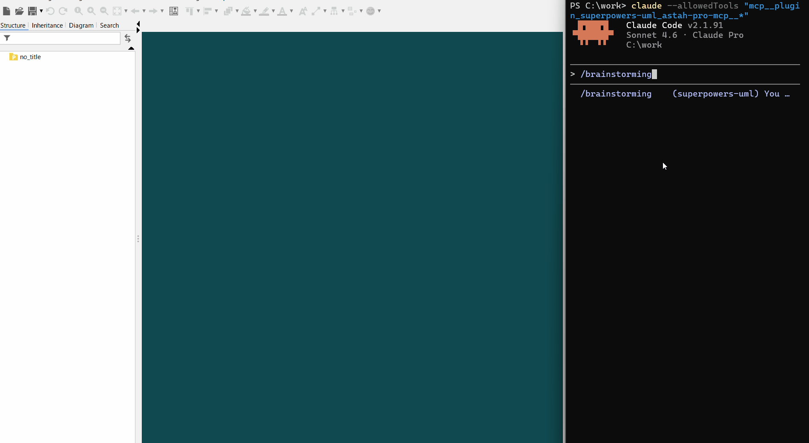
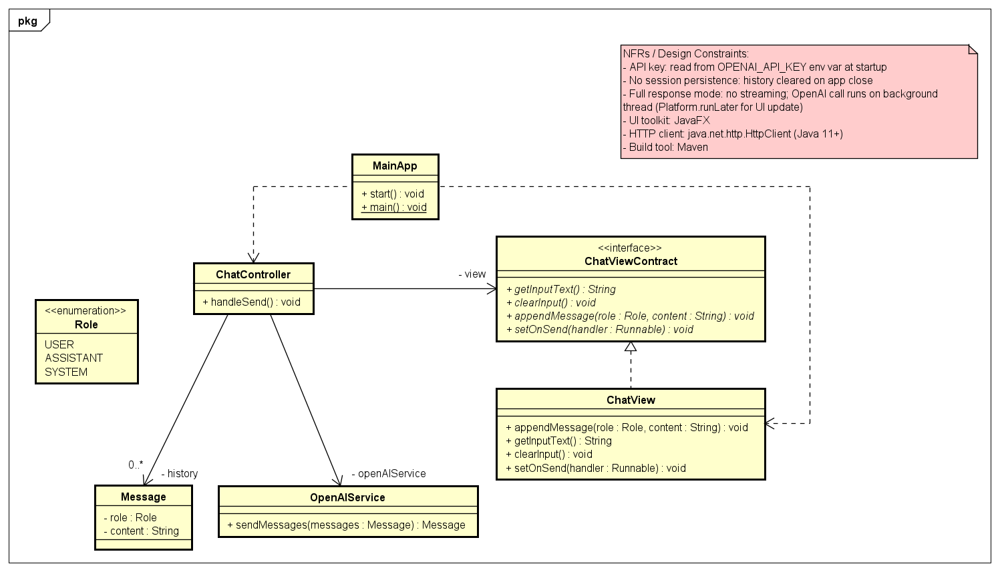
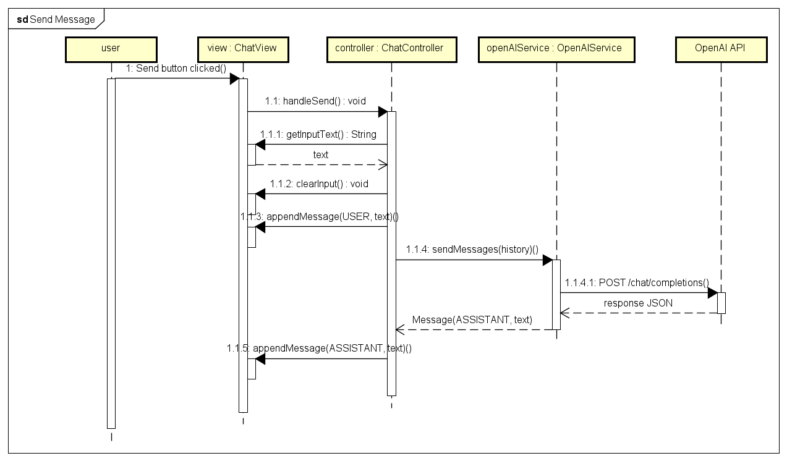
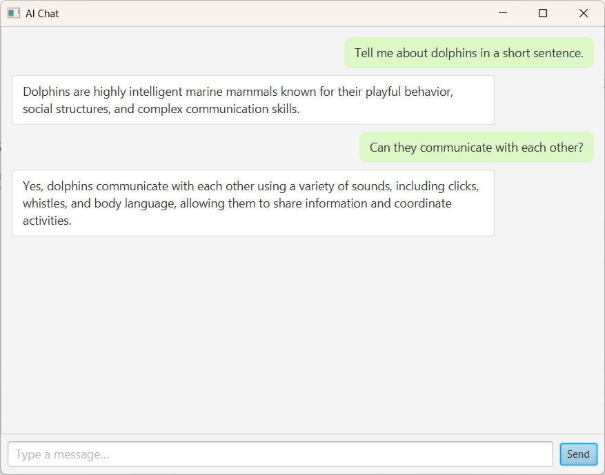

# Superpowers-UML: UML-enabled Superpowers

Superpowers-UML modifies [Superpowers](https://github.com/obra/superpowers) to ensure a software development workflow in which AI agents design through UML modeling.

Key modifications to Superpowers:
- The AI agent represents the specifications, including the software design *[1]*, as a UML model.
- The user and the AI agent collaboratively refine the specifications and the design *[1]* through UML modeling.
- The AI agent creates an implementation plan based on the user-approved UML model.
- The AI agent revises the UML model so that it matches the implemented code.
- Only Claude Code is supported, as this project relies on Claude Code-specific features such as Hooks and Subagents.

<small>*[1]*: In the future, the specification and design artifacts may be separated.</small>

## Demo

Request: *Create a desktop AI chat app in Java*  
Agent: Claude Code with Sonnet 4.6  
Processing time: 90 minutes  



<br>

Created UML diagrams and an AI chat application:
<table>
  <tr>
    <td><a href="demo/class-diagram.png"></a></td>
    <td><a href="demo/sequence-diagram.png"></a></td>
    <td><a href="demo/ai-chat-app.png"></a></td>
  </tr>
</table>

## Requirements

- [Claude Code](https://claude.com/product/claude-code)
- [Astah Pro](https://astah.net/products/astah-professional/) **v11.0 or later**
- [Astah Pro MCP](https://github.com/takaakit/astah-pro-mcp) **v0.2.0 or later**

> *Info:* We have not measured the exact figures, but using Superpowers-UML in Claude Code with Sonnet 4.6 for about 40 minutes reaches the Pro plan's 5-hour token limit. If you want to use Superpowers-UML comfortably, the **Max plan** may be better. For the AI agent model, we recommend **Sonnet** or **Opus** in terms of the quality of the generated UML models and the ability to accurately follow the workflow.

## Install

- Install Claude Code

- Install Astah Pro

- Install the Astah Pro MCP plugin in Astah Pro
  > *Install steps:* Launch Astah Pro -> drag and drop the Astah Pro MCP JAR file onto the Astah Pro window -> restart Astah Pro.

- Install the Superpowers-UML plugin in Claude Code via the marketplace
    ```bash
    /plugin marketplace add https://github.com/takaakit/superpowers-uml.git
    ```

    ```bash
    /plugin install superpowers-uml@superpowers-uml-dev
    ```

    ```bash
    /reload-plugins
    ```

## Uninstall

- Uninstall the Superpowers-UML plugin in Claude Code
    ```bash
    /plugin uninstall superpowers-uml@superpowers-uml-dev
    ```

    ```bash
    /plugin marketplace remove superpowers-uml-dev
    ```

- If you want to remove it completely, manually delete the `~/.claude/plugins/cache/superpowers-uml` directory.

## Update

- Update the Superpowers-UML plugin in Claude Code
    ```bash
    /plugin update superpowers-uml@superpowers-uml-dev
    ```

## Usage

1. It is recommended to disable unused MCP tools to avoid reducing the AI agent's tool-calling accuracy.

2. Launch Astah Pro with the Astah Pro MCP plugin installed

   > *Note:* Launch Astah Pro before starting Claude Code, and it should remain open throughout the entire workflow.

3. Open a terminal and go to your project directory

4. Launch Claude Code with this command to temporarily allow the use of tools:
   ```bash
   claude --allowedTools "mcp__plugin_superpowers-uml_astah-pro-mcp__*"
   ```
   A confirmation dialog will pop up on initial connection. Check it and click 'Connect'.

5. Start the workflow by running this command in Claude Code
   ```bash
   /brainstorming
   ```

   > *Tip 1:* In Superpowers-UML, no specific design policy is prescribed; the choice of design approach is left to the AI agent. If you want to specify one, a possible approach may be to have the AI agent refer to a document that describes the design policy (e.g., [DDD Reference](https://www.domainlanguage.com/ddd/reference/)) before starting the workflow, and then instruct the agent to design in accordance with that policy.

   > *Tip 2:* If you want to start in the middle of the workflow, send the prompt "List superpowers-uml commands" to display the available commands, then use the appropriate command.

## Additional Info

- AI agents refer to information provided by [OMG](https://www.omg.org/) to understand UML.
- AI agents follow [Agile Modeling](https://agilemodeling.com/) guidelines when creating a UML model.

## License

- The original [Superpowers](https://github.com/obra/superpowers) is copyright © Jesse Vincent and licensed under the **MIT** license.
- All modifications and new content added by this project are released under the **CC0 1.0 Universal** (Public Domain) license.

## Contributing

If you have a proposed improvement, please open an issue. Note that **any improvements submitted will be released under the CC0 license**.

## Links

- [Superpowers](https://github.com/obra/superpowers)
- [Claude Code](https://claude.com/product/claude-code)
- [Astah Pro](https://astah.net/products/astah-professional/)
- [Astah Pro MCP](https://github.com/takaakit/astah-pro-mcp)
- [OMG](https://www.omg.org/)
- [Agile Modeling](https://agilemodeling.com/)
- [DDD Reference](https://www.domainlanguage.com/ddd/reference/)
